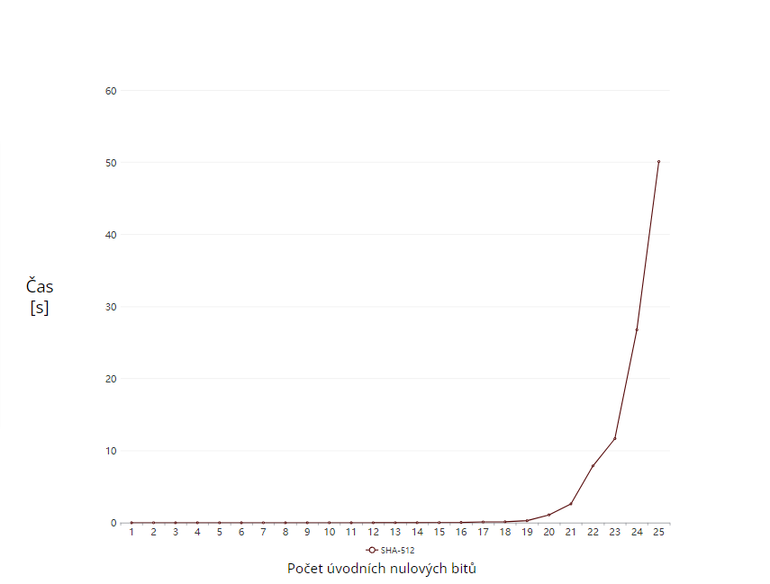

# SHA-512

Pridanie požiadavku na ďalšiu 0 na začiatku hashu zvýšilo čas hľadania v priemere 1,85 násobne. \
Hash s 23 nulami sa podarilo nájsť za ~11,67 sekúnd. \
Nájdenie hashu s 512 nulami by trvalo približne 1.85^489 * 11.67  ~  5.17 * 10^131 sekúnd (1.64 * 10^124 rokov). 