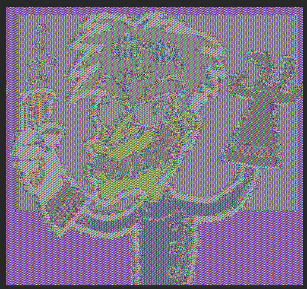
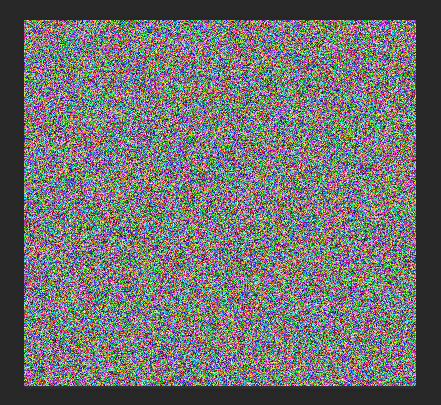

Kompilace: make 

spuštení: \
./encrypt &nbsp;&nbsp; [Celý název souboru (Mad_scientist.tga)] &nbsp; &nbsp;[mód šifrování] \
./decrypt &nbsp;&nbsp; [Celý název souboru (Mad_scientist_ecb.tga)] &nbsp;&nbsp; [mód šifrování] 

Módy šiforvání: \
1 = ECB \
2 = CBC    

Operačný mód ECB šifruje blok po bloku vždy rovnakým spôsobom, pri postupnom šifrovaní obrázkov tak vizuálne dochádza \
ku zmene farby pixelu, no vždy sa pixel(alebo blok pixelov) jednej farby zmení na tú istú farbu, \
obrázok býva často stále rozpoznateľný ja po zašifrovaní. 

 \
Mód CBC mení šifrovanie na základe predošlého bloku, pixel jednej farby tak môže mať po zašifrovaní vždy inú farbu a obrázok nie je rozpoznateľný. 

